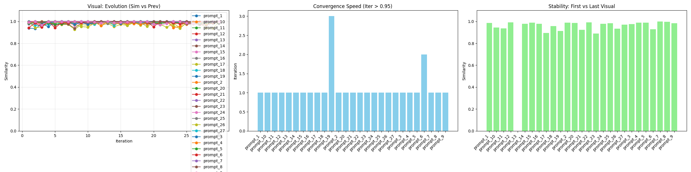
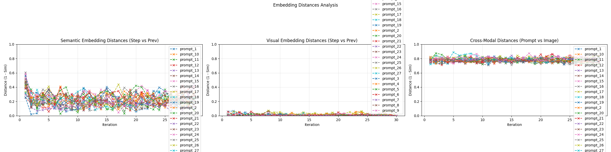
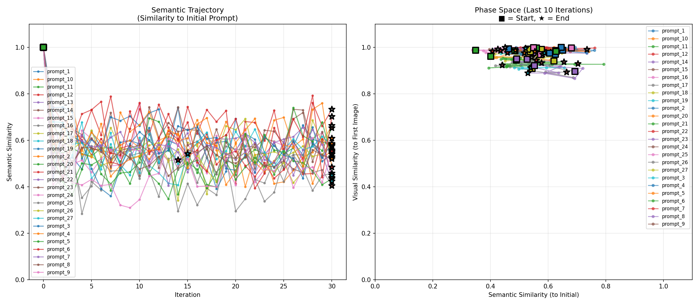
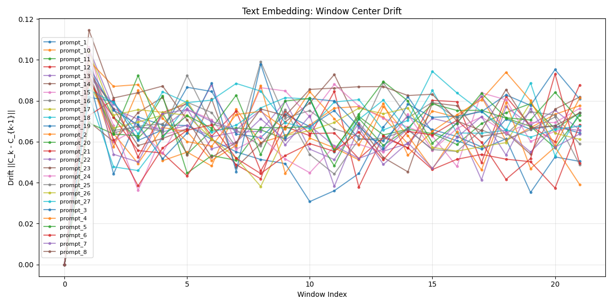
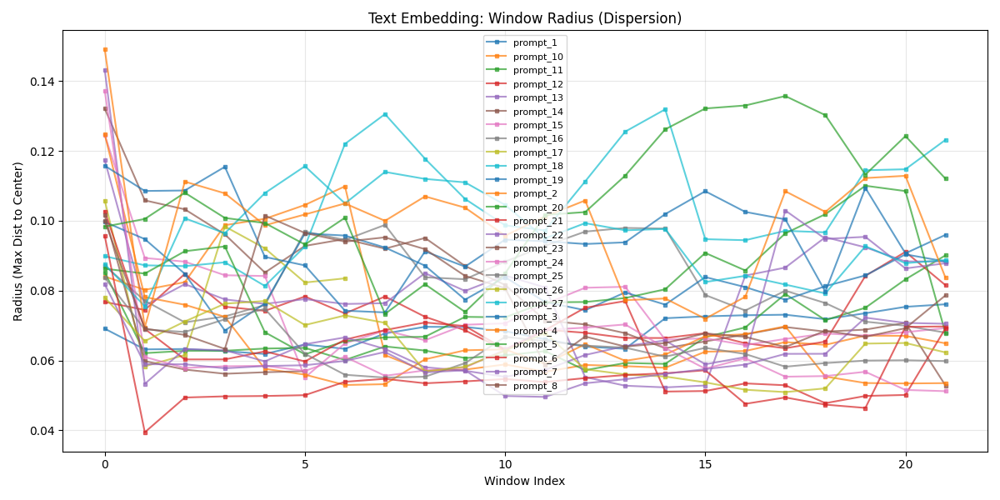
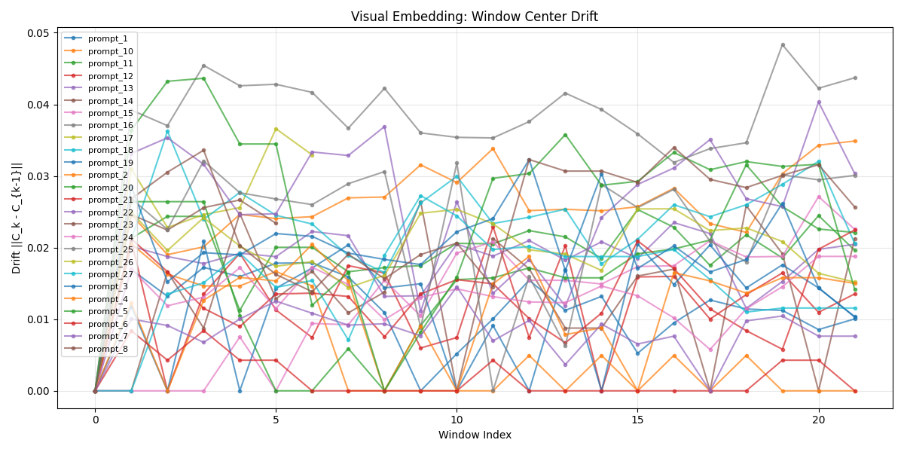
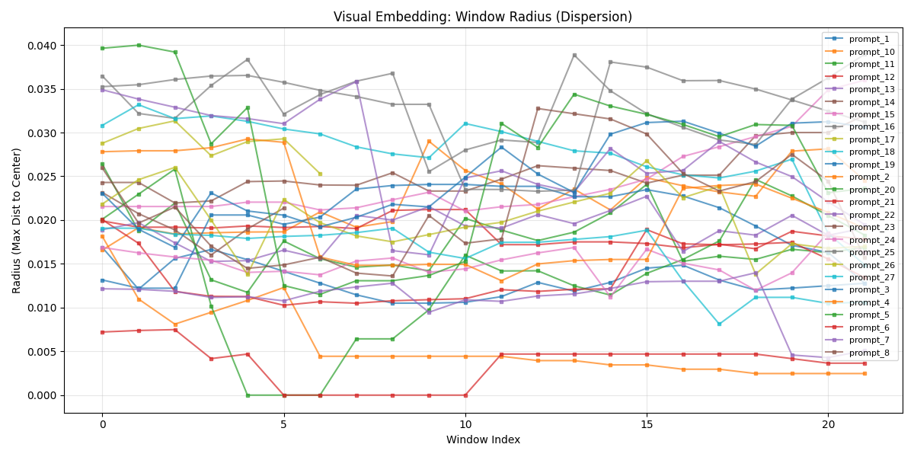
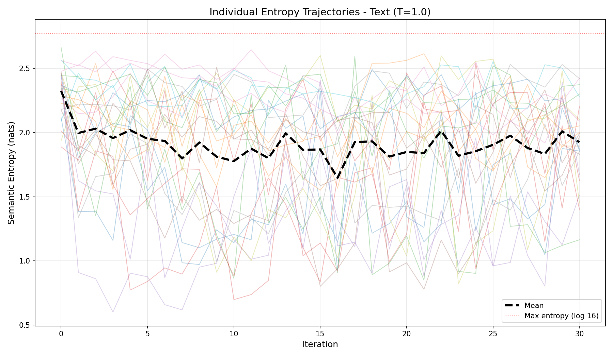

# Batch Experiment Report
**Date:** 2026-01-15 21:30:57
**Batch Directory:** `vision_temp_1.0`

## 1. Experimental Setup
| Parameter | Value |
|---|---|
| **Models** | Text: `openai/gpt-4o-mini`   Vision: `google/gemini-2.0-flash-001` |
| **Temperatures** | Text: `0.1`   Vision: `0.7` |
| **Iterations** | 30 |
| **Embedding Model** | `siglip` |

## 2. Batch Analysis
### Aggregate Statistics
| Metric | Mean | Min | Max |
|---|---|---|---|
| **Semantic Stability** (First-Last) | 0.562 | 0.405 | 1.000 |
| **Visual Stability** (First-Last) | 0.965 | 0.890 | 1.000 |
| **Semantic Convergence** (Step) | 26.8 | 2 | 32 |
| **Visual Convergence** (Step) | 2.1 | 2 | 4 |
| **Total Cost** | $0.3348 (Avg: $0.0124/run) | - | - |

### Visualizations
#### Semantic Analysis

#### Visual Analysis

#### Embedding Distances

#### Trajectory Analysis

#### Window Analysis - Text Embeddings

#### Window Analysis - Visual Embeddings

#### Semantic Entropy Trajectories

#### Semantic Entropy Trajectories (Problem 2)

## 3. Individual Experiments
| Run | Initial Prompt | Sem Stab. | Vis Stab. | Cost |
|---|---|---|---|---|
| [prompt_1](./prompt_1/trajectory.json) | A simple user authentication flow. User inputs credentials, ... | 0.584 | 0.987 | $0.0063 |
| [prompt_10](./prompt_10/trajectory.json) | A CI/CD pipeline with rollback. Commit -> Test. Fail? Notify... | 0.558 | 0.945 | $0.0176 |
| [prompt_11](./prompt_11/trajectory.json) | An event sourcing loop. User Action -> Event Bus -> Consumer... | 0.654 | 0.937 | $0.0128 |
| [prompt_12](./prompt_12/trajectory.json) | A garbage collection mark-and-sweep. Scanner traces roots, m... | 0.733 | 0.992 | $0.0101 |
| [prompt_13](./prompt_13/trajectory.json) | A home thermostat. Sensor reads Temp. If Low, Heater On. Tem... | 1.000 | 0.979 | $0.0127 |
| [prompt_14](./prompt_14/trajectory.json) | The hydrological water cycle. Ocean water Evaporates into Cl... | 0.608 | 0.988 | $0.0080 |
| [prompt_15](./prompt_15/trajectory.json) | An engine combustion cycle. Intake valve opens, Piston moves... | 0.547 | 0.978 | $0.0151 |
| [prompt_16](./prompt_16/trajectory.json) | The Hero's Journey. Ordinary World -> Call to Adventure -> O... | 0.458 | 0.893 | $0.0130 |
| [prompt_17](./prompt_17/trajectory.json) | The Scientific Method. Observe -> Hypothesize -> Experiment ... | 0.663 | 0.957 | $0.0280 |
| [prompt_18](./prompt_18/trajectory.json) | The Design Thinking process. Empathize -> Define -> Ideate -... | 0.542 | 0.913 | $0.0152 |
| [prompt_19](./prompt_19/trajectory.json) | E-commerce Microservices. API Gateway routes to Product Serv... | 0.539 | 0.990 | $0.0206 |
| [prompt_2](./prompt_2/trajectory.json) | A password reset flow. User requests reset, System sends Ema... | 0.552 | 0.987 | $0.0077 |
| [prompt_20](./prompt_20/trajectory.json) | A Kubernetes Cluster Architecture. Control Plane manages Nod... | 0.434 | 0.924 | $0.0083 |
| [prompt_21](./prompt_21/trajectory.json) | A React Component Tree. App Component holds Header, Main, Fo... | 0.440 | 0.992 | $0.0091 |
| [prompt_22](./prompt_22/trajectory.json) | The Solar System. Sun at center. Inner Planets (Mercury, Ven... | 0.424 | 0.890 | $0.0114 |
| [prompt_23](./prompt_23/trajectory.json) | A Biological Trophic Pyramid. Producers (Plants) at base. Pr... | 0.529 | 0.977 | $0.0275 |
| [prompt_24](./prompt_24/trajectory.json) | Human Nervous System. Central NS (Brain, Spine). Peripheral ... | 0.516 | 0.984 | $0.0226 |
| [prompt_25](./prompt_25/trajectory.json) | A Biological Taxonomy. Domain Eukarya -> Kingdom Animalia ->... | 0.405 | 0.934 | $0.0064 |
| [prompt_26](./prompt_26/trajectory.json) | A Corporate Org Chart. CEO leads VP Eng, VP Sales, VP HR. VP... | 0.576 | 0.970 | $0.0122 |
| [prompt_27](./prompt_27/trajectory.json) | A Decision Tree for Loan Approval. Credit Score > 700? Yes -... | 0.580 | 0.976 | $0.0118 |
| [prompt_3](./prompt_3/trajectory.json) | An email subscription process. User submits email, System ad... | 0.587 | 0.988 | $0.0043 |
| [prompt_4](./prompt_4/trajectory.json) | A gravity-fed water filtration system. Rainwater to Gutter, ... | 0.485 | 0.989 | $0.0078 |
| [prompt_5](./prompt_5/trajectory.json) | A manufacturing assembly line. Raw material enters Conveyor,... | 0.529 | 0.930 | $0.0071 |
| [prompt_6](./prompt_6/trajectory.json) | A traffic light sequence. Green light stays for 60s, turns Y... | 0.703 | 1.000 | $0.0063 |
| [prompt_7](./prompt_7/trajectory.json) | A logical syllogism chain. Premise A implies B. B implies C.... | 0.450 | 0.996 | $0.0159 |
| [prompt_8](./prompt_8/trajectory.json) | A historical timeline of 3 events. Event A causes Event B. E... | 0.521 | 0.983 | $0.0047 |
| [prompt_9](./prompt_9/trajectory.json) | An algebraic derivation. Start with Equation 1, substitute V... | 0.553 | 0.000 | $0.0122 |

## 4. Detailed Experiment Log
### prompt_1
**Initial Prompt:**
> A simple user authentication flow. User inputs credentials, System validates hash, returns Token or Error.

- **Cost:** $0.0063
- **Data:** [trajectory.json](./prompt_1/trajectory.json), [metrics.json](./prompt_1/metrics.json)
---
### prompt_10
**Initial Prompt:**
> A CI/CD pipeline with rollback. Commit -> Test. Fail? Notify Dev (Loop). Pass? Deploy. Monitor Health. bad? Rollback (Loop).

- **Cost:** $0.0176
- **Data:** [trajectory.json](./prompt_10/trajectory.json), [metrics.json](./prompt_10/metrics.json)
---
### prompt_11
**Initial Prompt:**
> An event sourcing loop. User Action -> Event Bus -> Consumer updates View DB. View reflects new state to User.

- **Cost:** $0.0128
- **Data:** [trajectory.json](./prompt_11/trajectory.json), [metrics.json](./prompt_11/metrics.json)
---
### prompt_12
**Initial Prompt:**
> A garbage collection mark-and-sweep. Scanner traces roots, marks reachable, sweeps unreachable, frees memory, waits for next cycle.

- **Cost:** $0.0101
- **Data:** [trajectory.json](./prompt_12/trajectory.json), [metrics.json](./prompt_12/metrics.json)
---
### prompt_13
**Initial Prompt:**
> A home thermostat. Sensor reads Temp. If Low, Heater On. Temp Rises. If High, Heater Off. Temp Falls.

- **Cost:** $0.0127
- **Data:** [trajectory.json](./prompt_13/trajectory.json), [metrics.json](./prompt_13/metrics.json)
---
### prompt_14
**Initial Prompt:**
> The hydrological water cycle. Ocean water Evaporates into Clouds. Clouds Condense into Rain. Rain flows into Rivers. Rivers return to Ocean.

- **Cost:** $0.0080
- **Data:** [trajectory.json](./prompt_14/trajectory.json), [metrics.json](./prompt_14/metrics.json)
---
### prompt_15
**Initial Prompt:**
> An engine combustion cycle. Intake valve opens, Piston moves down. Valve closes, Piston compresses. Spark plug fires (Combustion). Piston driven down. Exhaust valve opens.

- **Cost:** $0.0151
- **Data:** [trajectory.json](./prompt_15/trajectory.json), [metrics.json](./prompt_15/metrics.json)
---
### prompt_16
**Initial Prompt:**
> The Hero's Journey. Ordinary World -> Call to Adventure -> Ordeal -> Reward -> Return to Ordinary World (Changed).

- **Cost:** $0.0130
- **Data:** [trajectory.json](./prompt_16/trajectory.json), [metrics.json](./prompt_16/metrics.json)
---
### prompt_17
**Initial Prompt:**
> The Scientific Method. Observe -> Hypothesize -> Experiment -> Analyze. Data supports? Theory. Data rejects? New Hypothesis (Loop).

- **Cost:** $0.0280
- **Data:** [trajectory.json](./prompt_17/trajectory.json), [metrics.json](./prompt_17/metrics.json)
---
### prompt_18
**Initial Prompt:**
> The Design Thinking process. Empathize -> Define -> Ideate -> Prototype -> Test. Test fails? Ideate again (Loop).

- **Cost:** $0.0152
- **Data:** [trajectory.json](./prompt_18/trajectory.json), [metrics.json](./prompt_18/metrics.json)
---
### prompt_19
**Initial Prompt:**
> E-commerce Microservices. API Gateway routes to Product Service (Product DB), Order Service (Order DB), User Service (User DB).

- **Cost:** $0.0206
- **Data:** [trajectory.json](./prompt_19/trajectory.json), [metrics.json](./prompt_19/metrics.json)
---
### prompt_2
**Initial Prompt:**
> A password reset flow. User requests reset, System sends Email, User clicks Link, enters New Password.

- **Cost:** $0.0077
- **Data:** [trajectory.json](./prompt_2/trajectory.json), [metrics.json](./prompt_2/metrics.json)
---
### prompt_20
**Initial Prompt:**
> A Kubernetes Cluster Architecture. Control Plane manages Nodes. Nodes contain Pods. Pods contain Containers.

- **Cost:** $0.0083
- **Data:** [trajectory.json](./prompt_20/trajectory.json), [metrics.json](./prompt_20/metrics.json)
---
### prompt_21
**Initial Prompt:**
> A React Component Tree. App Component holds Header, Main, Footer. Main holds Sidebar and Content Area. Content Area holds Article List.

- **Cost:** $0.0091
- **Data:** [trajectory.json](./prompt_21/trajectory.json), [metrics.json](./prompt_21/metrics.json)
---
### prompt_22
**Initial Prompt:**
> The Solar System. Sun at center. Inner Planets (Mercury, Venus, Earth) orbit Sun. Earth has Moon. Outer Planets (Jupiter, Saturn) orbit Sun. Jupiter has many Moons.

- **Cost:** $0.0114
- **Data:** [trajectory.json](./prompt_22/trajectory.json), [metrics.json](./prompt_22/metrics.json)
---
### prompt_23
**Initial Prompt:**
> A Biological Trophic Pyramid. Producers (Plants) at base. Primary Consumers (Herbivores) eat Producers. Secondary Consumers (Carnivores) eat Primary. Decomposers recycle all.

- **Cost:** $0.0275
- **Data:** [trajectory.json](./prompt_23/trajectory.json), [metrics.json](./prompt_23/metrics.json)
---
### prompt_24
**Initial Prompt:**
> Human Nervous System. Central NS (Brain, Spine). Peripheral NS splits into Somatic and Autonomic. Autonomic splits into Sympathetic and Parasympathetic.

- **Cost:** $0.0226
- **Data:** [trajectory.json](./prompt_24/trajectory.json), [metrics.json](./prompt_24/metrics.json)
---
### prompt_25
**Initial Prompt:**
> A Biological Taxonomy. Domain Eukarya -> Kingdom Animalia -> Phylum Chordata -> Class Mammalia.

- **Cost:** $0.0064
- **Data:** [trajectory.json](./prompt_25/trajectory.json), [metrics.json](./prompt_25/metrics.json)
---
### prompt_26
**Initial Prompt:**
> A Corporate Org Chart. CEO leads VP Eng, VP Sales, VP HR. VP Eng leads Backend, Frontend, QA Teams.

- **Cost:** $0.0122
- **Data:** [trajectory.json](./prompt_26/trajectory.json), [metrics.json](./prompt_26/metrics.json)
---
### prompt_27
**Initial Prompt:**
> A Decision Tree for Loan Approval. Credit Score > 700? Yes -> Income > 50k? Yes -> Approve. No -> Deny.

- **Cost:** $0.0118
- **Data:** [trajectory.json](./prompt_27/trajectory.json), [metrics.json](./prompt_27/metrics.json)
---
### prompt_3
**Initial Prompt:**
> An email subscription process. User submits email, System adds to DB, System sends Welcome Email.

- **Cost:** $0.0043
- **Data:** [trajectory.json](./prompt_3/trajectory.json), [metrics.json](./prompt_3/metrics.json)
---
### prompt_4
**Initial Prompt:**
> A gravity-fed water filtration system. Rainwater to Gutter, Gutter to Pipe, Pipe to Filter, Filter to Tank.

- **Cost:** $0.0078
- **Data:** [trajectory.json](./prompt_4/trajectory.json), [metrics.json](./prompt_4/metrics.json)
---
### prompt_5
**Initial Prompt:**
> A manufacturing assembly line. Raw material enters Conveyor, Stamping Machine shapes it, Painting Station colors it, Packaging wraps it.

- **Cost:** $0.0071
- **Data:** [trajectory.json](./prompt_5/trajectory.json), [metrics.json](./prompt_5/metrics.json)
---
### prompt_6
**Initial Prompt:**
> A traffic light sequence. Green light stays for 60s, turns Yellow for 5s, turns Red for 60s.

- **Cost:** $0.0063
- **Data:** [trajectory.json](./prompt_6/trajectory.json), [metrics.json](./prompt_6/metrics.json)
---
### prompt_7
**Initial Prompt:**
> A logical syllogism chain. Premise A implies B. B implies C. Therefore A implies C.

- **Cost:** $0.0159
- **Data:** [trajectory.json](./prompt_7/trajectory.json), [metrics.json](./prompt_7/metrics.json)
---
### prompt_8
**Initial Prompt:**
> A historical timeline of 3 events. Event A causes Event B. Event B triggers Reaction C.

- **Cost:** $0.0047
- **Data:** [trajectory.json](./prompt_8/trajectory.json), [metrics.json](./prompt_8/metrics.json)
---
### prompt_9
**Initial Prompt:**
> An algebraic derivation. Start with Equation 1, substitute Variable X, simplify to Result Y.

- **Cost:** $0.0122
- **Data:** [trajectory.json](./prompt_9/trajectory.json), [metrics.json](./prompt_9/metrics.json)
---
